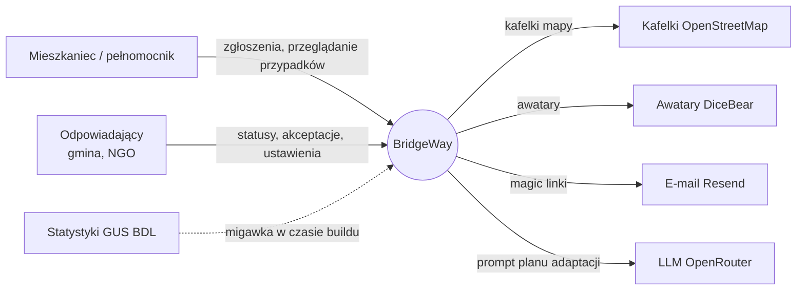
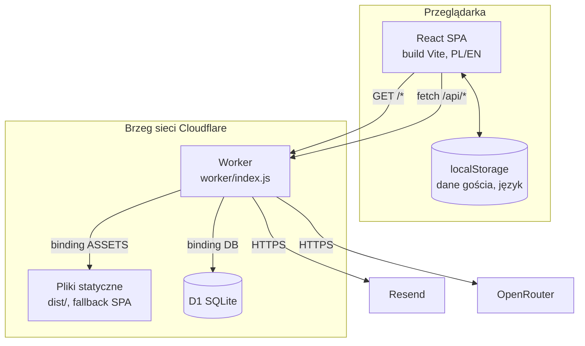
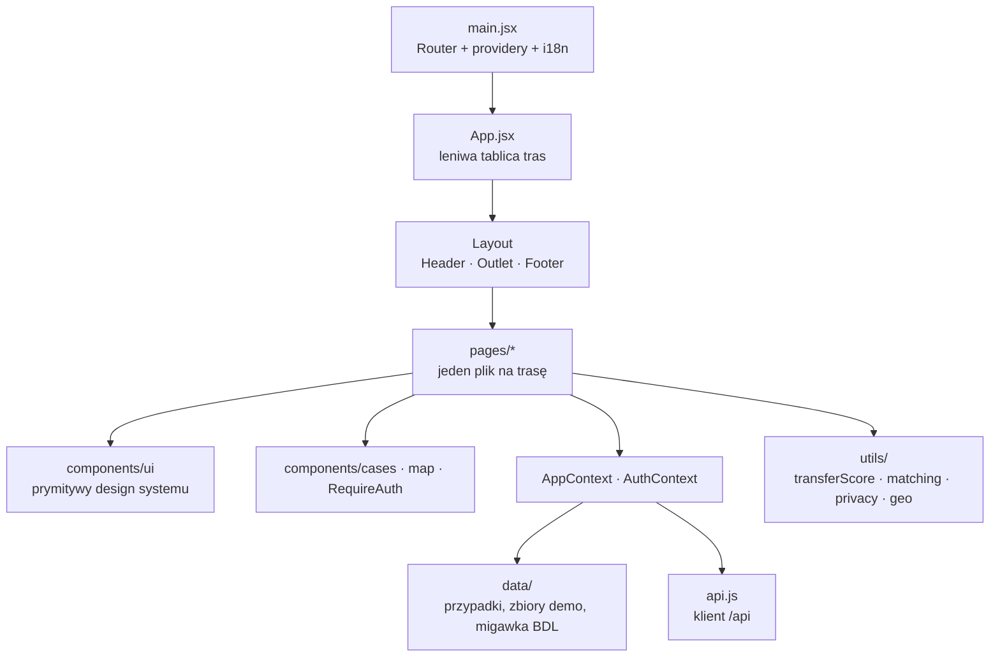
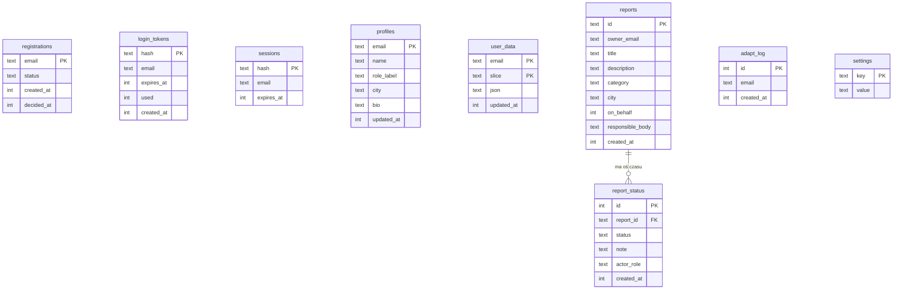
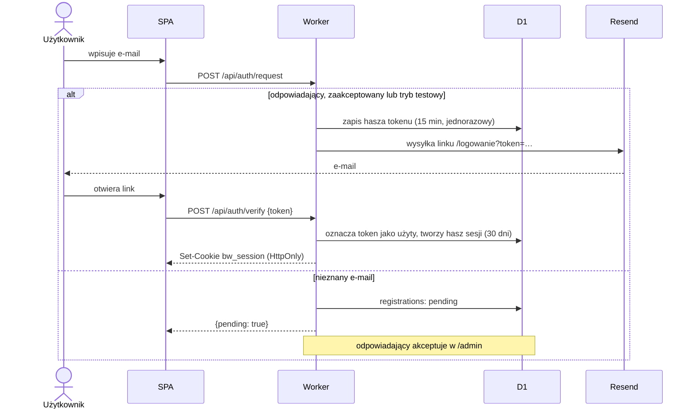
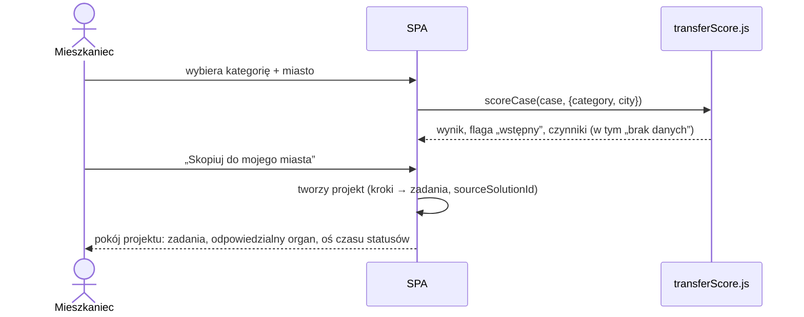
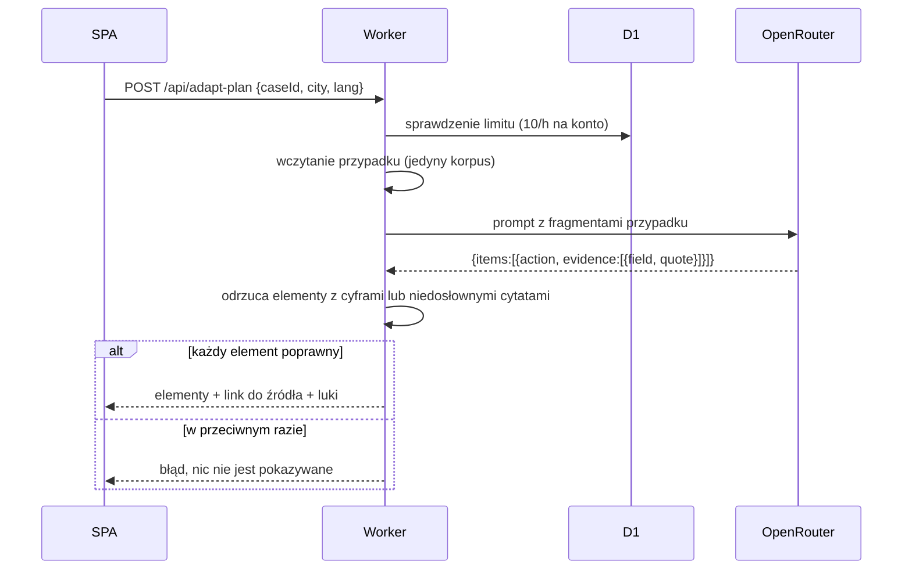

[← README](../README.md) · [Projekt](../README.md#o-projekcie) · [Specyfikacja techniczna](./TECH_SPEC.md) · **Architektura** · [Licencja](./LICENSE.md)

# BridgeWay: architektura

> © 2026 Dominik Liahovich. Wszelkie prawa zastrzeżone. Ta strona podsumowuje architekturę. Wiążącym źródłem jest [`architecture.md`](../architecture.md).

## Spis treści
1. [Czynniki architektoniczne](#1-czynniki-architektoniczne)
2. [Kontekst systemu](#2-kontekst-systemu)
3. [Kontenery i wdrożenie](#3-kontenery-i-wdrożenie)
4. [Architektura frontendu](#4-architektura-frontendu)
5. [Architektura backendu](#5-architektura-backendu)
6. [Przechowywanie danych](#6-przechowywanie-danych)
7. [Kluczowe przepływy](#7-kluczowe-przepływy)
8. [Zagadnienia przekrojowe](#8-zagadnienia-przekrojowe)
9. [Decyzje architektoniczne](#9-decyzje-architektoniczne)
10. [Struktura katalogów](#10-struktura-katalogów)
11. [Kierunki rozwoju](#11-kierunki-rozwoju)

---

## 1. Czynniki architektoniczne

| Czynnik | Konsekwencja |
|---|---|
| Budowane na hackathon, mały zespół | Jedno repozytorium, jeden artefakt wdrożeniowy, żadnych serwerów do utrzymania |
| Musi działać bez backendu | SPA „local-first”. Backend jest opcjonalnym rozszerzeniem |
| Zaufanie jest produktem | Deterministyczna punktacja, baza danych ze źródłami, zabezpieczony LLM |
| Użytkownicy w trudnej sytuacji | Prywatność i dostępność wbudowane od początku, a nie dodane później |
| Niemal zerowy koszt utrzymania | Darmowy plan Cloudflare: pliki na brzegu sieci, Worker, D1 |

## 2. Kontekst systemu



## 3. Kontenery i wdrożenie



- Wszystko obsługuje jedno wdrożenie Cloudflare Worker (`wrangler.jsonc`). `run_worker_first: ["/api/*"]` kieruje wywołania API do kodu Workera, a wszystkie pozostałe ścieżki trafiają do plików statycznych z fallbackiem do `index.html`.
- **Alternatywny hosting:** dowolny hosting statyczny (dołączona jest konfiguracja Netlify) uruchamia SPA w trybie lokalnym, bez API.
- **Rozwój lokalny:** Vite na `:5173` przekierowuje `/api` do `wrangler dev` na `:8787`, który używa lokalnej bazy D1.

## 4. Architektura frontendu



| Warstwa | Lokalizacja | Odpowiedzialność |
|---|---|---|
| Inicjalizacja | `src/main.jsx` | `BrowserRouter`, `AuthProvider`, `AppProvider`, i18n |
| Routing | `src/App.jsx` | leniwe `<Route>` z fallbackiem `Suspense` |
| Układ | `components/layout` | nagłówek/nawigacja, stopka, zarządzanie fokusem, tytuły kart |
| Strony | `src/pages` | wyłącznie kompozycja ekranów |
| Zestaw UI | `components/ui` | Button, Card, Badge, Chip, Input, Select, Modal, Toast, EmptyState, Skeleton, EvidenceBadge |
| Komponenty funkcji | `components/cases`, `components/map` | `ScoreBreakdown`, `AdaptPlan`, `MapView` |
| Strażnicy tras | `components/RequireAuth.jsx` | przekierowuje do `/logowanie`, gdy istnieje backend, a użytkownik nie jest zalogowany |
| Stan | `context/AppContext.jsx` | użytkownik, sygnały, pomysły, projekty, zapisane, filtry, powiadomienia i ich akcje |
| Sesja | `context/AuthContext.jsx` | dostępność backendu, konto, logowanie/wylogowanie |
| Logika domenowa | `src/utils` | czyste funkcje: punktacja, dopasowanie, prywatność, geo, formatowanie |
| Dane | `src/data` | opracowane przypadki, zbiory demo, migawka GUS |

**Strategia stanu:**
- **Gość:** każdy fragment stanu jest zapisywany w `localStorage` (klucze `bridgeart-*`).
- **Zalogowany:** prywatne fragmenty są trzymane w pamięci, ładowane z D1 przy logowaniu i zapisywane z powrotem z opóźnieniem 500 ms. Przy zmianie konta są resetowane, aby dane nigdy nie przeciekały między kontami.
- **Udostępniane zgłoszenia** zawsze pochodzą z API.
- **Encje statyczne** (przypadki, eksperci, organizacje, finansowanie) są czytane bezpośrednio z danych w paczce.

## 5. Architektura backendu

Jeden moduł Workera z małym, ręcznie napisanym routerem (bez frameworka):


- **Middleware uwierzytelniania:** czyta ciasteczko `bw_session`, wyszukuje hasz sesji i ustala rolę (`responder`, jeśli e-mail jest w `RESPONDER_EMAILS`, w przeciwnym razie `resident`).
- **Autoryzacja** jest sprawdzana dla każdej trasy: publiczna, sesja lub odpowiadający.
- **Walidacja:** rozmiary żądań i wartości wyliczeniowe są sprawdzane na brzegu (np. fragmenty user-data ≤ 256 KB, dozwolone nazwy fragmentów, wartości statusów).
- **Bezstanowość:** cały stan jest w D1, więc Worker może skalować się poziomo na brzegu sieci.

## 6. Przechowywanie danych

| Dane | Gdzie | Współdzielone? |
|---|---|---|
| Opracowane przypadki, katalogi demo | paczka JS (`src/data`) | tylko odczyt, dla wszystkich |
| Migawka kontekstu GUS | JSON w paczce | tylko odczyt |
| Dane gościa | `localStorage` przeglądarki | nie, tylko jedna przeglądarka |
| Dane konta (sygnały, pomysły, projekty, zapisane) | D1 `user_data` | nie, prywatne per konto |
| Udostępniane zgłoszenia i osie czasu | D1 `reports`, `report_status` | publiczny odczyt |
| Uwierzytelnianie, rejestracje, profile | D1 | prywatne |
| Ustawienia (tryb testowy, model LLM) | D1 `settings` | odpowiadający |



Adresy e-mail pełnią rolę naturalnego klucza użytkownika. Migracje znajdują się w `migrations/0001–0006` i są stosowane poleceniem `wrangler d1 migrations apply`.

## 7. Kluczowe przepływy

### 7.1 Logowanie magic linkiem z akceptacją


### 7.2 Wyszukanie i przeniesienie przypadku

Ten przepływ działa w całości w przeglądarce, bez wywołań sieciowych.

### 7.3 Zabezpieczony plan adaptacji


### 7.4 Cykl życia zgłoszenia
`przyjęte → przypisane → w realizacji → rozwiązane | odrzucone (wymagane uzasadnienie)`. Każda zmiana to nowy wiersz `report_status`, który zapisuje rolę wykonawcy, więc oś czasu jest tylko dopisywana i audytowalna. `GET /api/metrics` wylicza czas do pierwszej odpowiedzi z pierwszego wiersza innego niż `received`.

## 8. Zagadnienia przekrojowe

| Zagadnienie | Podejście |
|---|---|
| Bezpieczeństwo | zahaszowane tokeny, ciasteczko HttpOnly, JSON z tego samego źródła dla zapisów, sekrety tylko w środowisku Workera, minimum wywołań zewnętrznych |
| Prywatność | dane tylko na poziomie miasta, zgrubienie współrzędnych wrażliwych zgłoszeń, izolacja per konto, zagregowane metryki |
| Dostępność | konwencje WCAG AA w prymitywach UI, zarządzanie fokusem i tytułami w `Layout`, ograniczony ruch |
| i18n | wszystkie teksty przez klucze i18next (pl/en); dwujęzyczna treść `{pl,en}` w danych |
| Uczciwość | etykiety demo (`common.demo`), `null` → „nie podano”, wyniki wstępne, walidacja cytatów LLM |
| Obserwowalność | logi Cloudflare Worker; wywołania planu adaptacji logowane tylko na potrzeby limitów |
| Koszt | hosting na brzegu sieci w darmowym planie; model LLM i jego cenę wybiera odpowiadający |

## 9. Decyzje architektoniczne

| # | Decyzja | Dlaczego | Kompromis |
|---|---|---|---|
| AD-1 | SPA local-first z opcjonalnym backendem | demo nigdy nie może zawieść; działa na każdym hostingu statycznym | dwie ścieżki danych (lokalna i D1) |
| AD-2 | Jeden Cloudflare Worker dla plików i API | jeden artefakt, to samo źródło, brak CORS | uzależnienie od Cloudflare |
| AD-3 | D1 (SQLite) zamiast zarządzanego serwera SQL | zero utrzymania, darmowy plan, migracje SQL | zapisy w jednym regionie, limity rozmiaru |
| AD-4 | Logowanie bez hasła przez magic linki | brak przechowywania haseł, zweryfikowane posiadanie e-maila | zależność od dostarczania e-maili |
| AD-5 | Deterministyczna, widoczna punktacja zamiast rankingu ML | wyjaśnialna i audytowalna; bez wymyślonej precyzji | mniej „inteligentny” ranking |
| AD-6 | LLM ograniczony do jednego przypadku, z walidacją dosłownych cytatów | zapobiega zmyślonym faktom i źródłom | część poprawnych planów jest odrzucana |
| AD-7 | Dane GUS pobierane w czasie buildu | brak zależności i limitów w czasie obsługi żądań | migawkę trzeba odświeżać ręcznie |
| AD-8 | Opracowana baza przypadków w kodzie | każdy przypadek jest przejrzany, ma źródło i ocenę | dodanie przypadku wymaga wdrożenia |
| AD-9 | Leniwie ładowane strony, mapa w osobnym chunku | szybkie pierwsze ładowanie na słabych urządzeniach | więcej żądań sieciowych |

## 10. Struktura katalogów

```
bridgeway-app/
├─ src/
│  ├─ main.jsx, App.jsx, i18n.js, index.css, api.js
│  ├─ context/        AppContext.jsx, AuthContext.jsx
│  ├─ components/     layout/, ui/, map/, cases/, RequireAuth.jsx
│  ├─ pages/          jeden plik na trasę
│  ├─ utils/          transferScore, matching, privacy, geo, formatters
│  ├─ hooks/          useLocalStorage, useDebounce
│  └─ data/           index.js (przypadki + dane demo), bdlContext.json
├─ worker/            index.js (router API), adaptPlan.js
├─ migrations/        0001–0006 schemat D1
├─ scripts/           fetch-bdl-context.mjs
├─ docs/              zakładki README (specyfikacja techniczna, architektura, licencja)
├─ public/            pliki statyczne
├─ *.md               specyfikacje (architecture, roadmap, concept_v1.0, sourcing-spike, accessibility, validation)
├─ wrangler.jsonc     konfiguracja Cloudflare
└─ netlify.toml       alternatywny hosting statyczny
```

## 11. Kierunki rozwoju

1. **Więcej współdzielenia:** przeniesienie pomysłów, projektów i sygnałów z mapy do D1, z moderacją.
2. **Rejestr odpowiedzialnych organów:** zastąpienie listy w zmiennej środowiskowej zweryfikowanymi instytucjami i regułami kierowania.
3. **Dane na żywo:** realne nabory grantowe; więcej wskaźników GUS (gęstość zaludnienia, dochód) dla czynnika kontekstu.
4. **Baza przypadków jako dane:** proces edycji przypadków z przeglądem i oceną dowodów, przechowywany w D1 zamiast w kodzie.
5. **Jakość:** testy automatyczne (punktacja, walidacja, API), pełny audyt dostępności, pułapka fokusu w oknach modalnych.
6. **Panel dla gmin:** raportowanie czasu odpowiedzi i ponownego wykorzystania per gmina (model trwałości).

---

[← Specyfikacja techniczna](./TECH_SPEC.md) · [Licencja →](./LICENSE.md)
