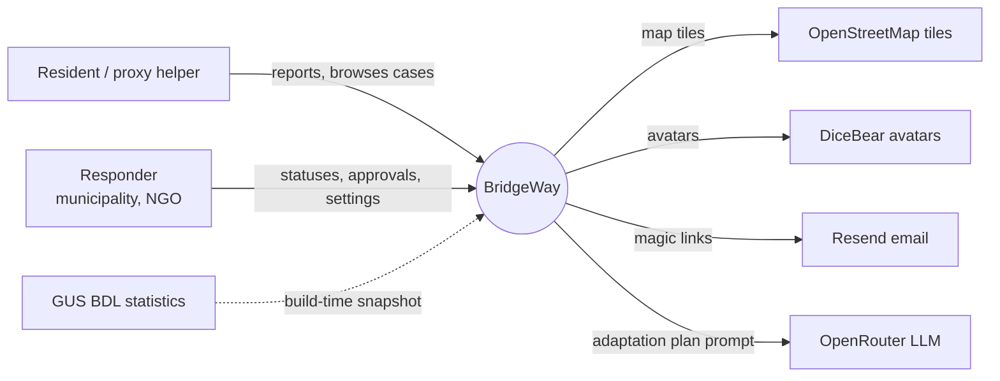
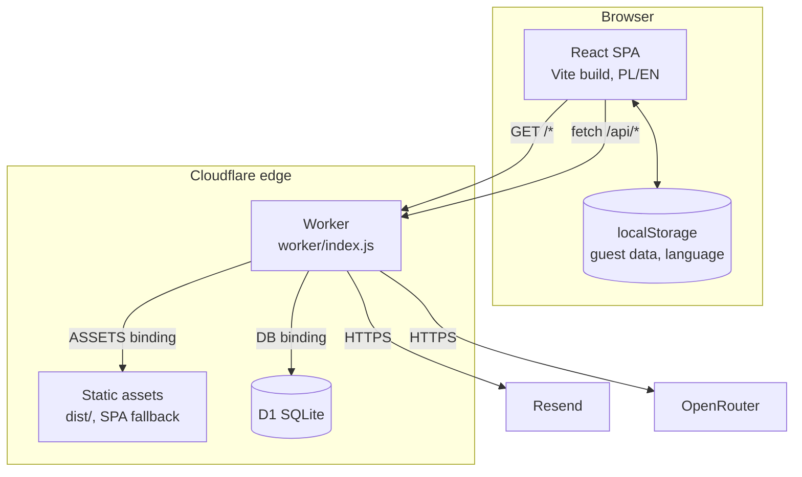
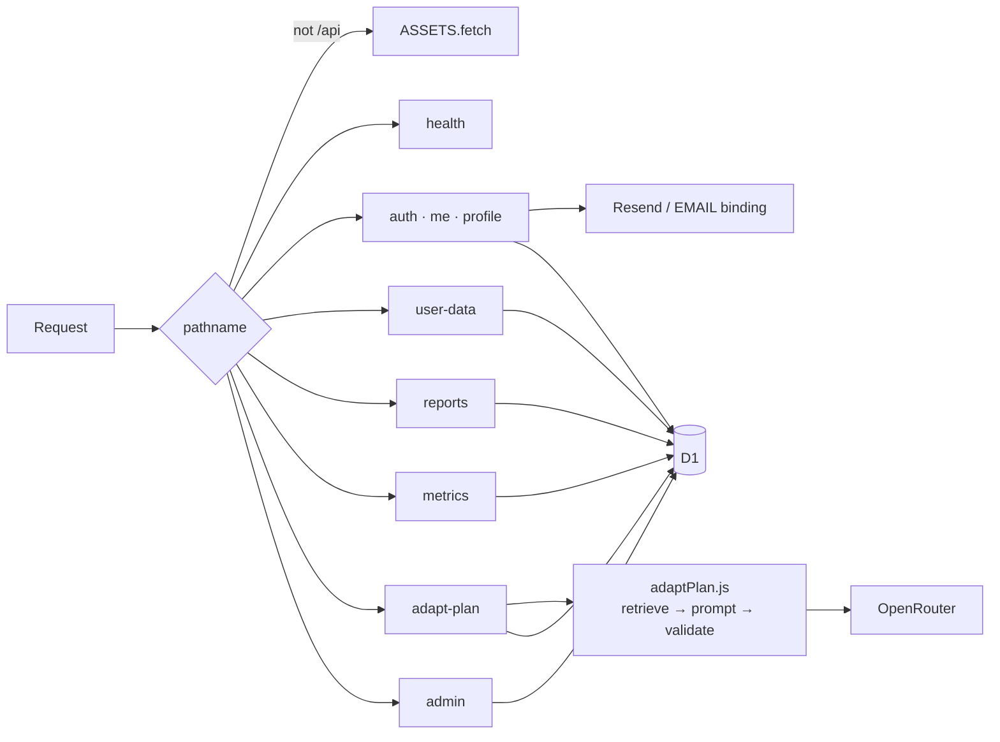
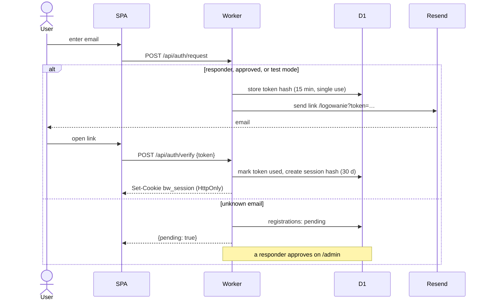
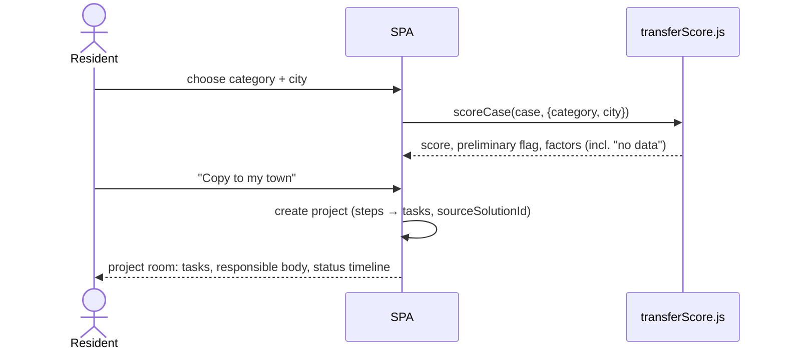
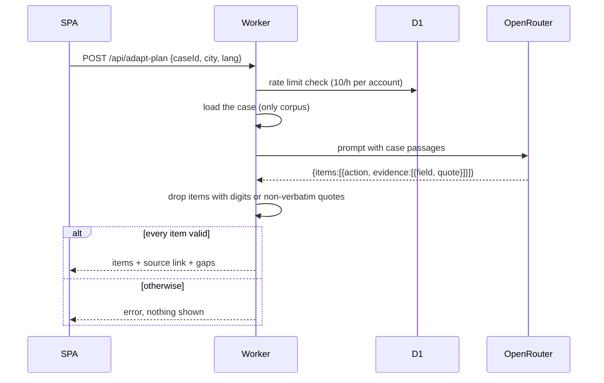

[← README](../README.md) · [Project](../README.md#about) · [Tech spec](./TECH_SPEC.md) · **Architecture** · [License](./LICENSE.md)

# BridgeWay: architecture

> © 2026 Dominik Liahovich. All rights reserved. This page summarises the architecture. The authoritative source is [`spec/architecture.md`](../spec/architecture.md).

## Contents
1. [Architectural drivers](#1-architectural-drivers)
2. [System context](#2-system-context)
3. [Containers and deployment](#3-containers-and-deployment)
4. [Frontend architecture](#4-frontend-architecture)
5. [Backend architecture](#5-backend-architecture)
6. [Data storage](#6-data-storage)
7. [Key flows](#7-key-flows)
8. [Cross-cutting concerns](#8-cross-cutting-concerns)
9. [Architecture decisions](#9-architecture-decisions)
10. [Directory layout](#10-directory-layout)
11. [Evolution path](#11-evolution-path)

---

## 1. Architectural drivers

| Driver | Consequence |
|---|---|
| Built for a hackathon, small team | One repo, one deployable, no servers to manage |
| Must work without a backend | Local-first SPA. The backend is an optional enhancement |
| Trust is the product | Deterministic scoring, a sourced data base, a guarded LLM |
| Vulnerable users | Privacy and accessibility are built in, not added later |
| Near-zero running cost | Cloudflare free tier: edge assets, Worker, D1 |

## 2. System context



## 3. Containers and deployment



- A single Cloudflare Worker deployment (`wrangler.jsonc`) serves everything. `run_worker_first: ["/api/*"]` sends API calls to the Worker code, and all other paths go to static assets with a fallback to `index.html`.
- **Alternative hosting:** any static host (a Netlify config is included) runs the SPA in local mode without the API.
- **Local development:** Vite on `:5173` proxies `/api` to `wrangler dev` on `:8787`, which uses a local D1 database.

## 4. Frontend architecture


| Layer | Location | Responsibility |
|---|---|---|
| Bootstrap | `src/main.jsx` | `BrowserRouter`, `AuthProvider`, `AppProvider`, i18n |
| Routing | `src/App.jsx` | lazy `<Route>`s with a `Suspense` fallback |
| Layout | `components/layout` | header/nav, footer, focus management, tab titles |
| Pages | `src/pages` | screen composition only |
| UI kit | `components/ui` | Button, Card, Badge, Chip, Input, Select, Modal, Toast, EmptyState, Skeleton, EvidenceBadge |
| Feature components | `components/cases`, `components/map` | `ScoreBreakdown`, `AdaptPlan`, `MapView` |
| Guards | `components/RequireAuth.jsx` | redirects to `/logowanie` when a backend exists and the user isn't logged in |
| State | `context/AppContext.jsx` | user, signals, ideas, projects, saved, filters, toasts and their actions |
| Session | `context/AuthContext.jsx` | backend availability, account, login/logout |
| Domain logic | `src/utils` | pure functions: scoring, matching, privacy, geo, formatting |
| Data | `src/data` | curated cases, demo datasets, GUS snapshot |

**State strategy:**
- **Guest:** each state slice persists in `localStorage` (`bridgeart-*` keys).
- **Logged in:** private slices are held in memory, loaded from D1 at login, and saved back with a 500 ms debounce. When the account changes, they are reset so that data never leaks between accounts.
- **Shared reports** always come from the API.
- **Static entities** (cases, experts, NGOs, funding) are read directly from bundled data.

## 5. Backend architecture

A single Worker module with a small hand-written router (no framework):



- **Auth middleware:** reads the `bw_session` cookie, looks up the session hash, and resolves the role (`responder` if the email is in `RESPONDER_EMAILS`, otherwise `resident`).
- **Authorisation** is checked per route: public, session, or responder.
- **Validation:** request sizes and enums are checked at the edge (e.g. user-data slices ≤ 256 KB, allowed slice names, status values).
- **Stateless:** all state lives in D1, so the Worker can scale horizontally at the edge.

## 6. Data storage

| Data | Where | Shared? |
|---|---|---|
| Curated cases, demo directories | JS bundle (`src/data`) | read-only, everyone |
| GUS context snapshot | JSON in the bundle | read-only |
| Guest data | browser `localStorage` | no, one browser only |
| Account data (signals, ideas, projects, saved) | D1 `user_data` | no, private per account |
| Shared reports and timelines | D1 `reports`, `report_status` | public read |
| Auth, registrations, profiles | D1 | private |
| Settings (test mode, LLM model) | D1 `settings` | responders |


Emails act as the natural user key. Migrations live in `migrations/0001–0006` and are applied with `wrangler d1 migrations apply`.

## 7. Key flows

### 7.1 Magic-link login with approval


### 7.2 Finding and transferring a case

This flow runs entirely in the browser, with no network calls.

### 7.3 Guarded adaptation plan


### 7.4 Report lifecycle
`received → assigned → in progress → resolved | rejected (note required)`. Each change is a new `report_status` row that records the actor role, so the timeline is append-only and auditable. `GET /api/metrics` derives the time to first response from the first non-`received` row.

## 8. Cross-cutting concerns

| Concern | Approach |
|---|---|
| Security | hashed tokens, HttpOnly cookie, same-origin JSON for writes, secrets only in Worker env, minimal external calls |
| Privacy | city-level data only, coordinate coarsening for sensitive reports, per-account isolation, aggregate metrics |
| Accessibility | WCAG AA conventions in UI primitives, focus and title management in `Layout`, reduced motion |
| i18n | all strings via i18next keys (pl/en); bilingual `{pl,en}` content in data |
| Honesty | demo labels (`common.demo`), `null` → "not stated", preliminary scores, LLM quote validation |
| Observability | Cloudflare Worker logs; adaptation-plan calls logged for rate limiting only |
| Cost | free-tier edge hosting; LLM model and price chosen by a responder |

## 9. Architecture decisions

| # | Decision | Why | Trade-off |
|---|---|---|---|
| AD-1 | Local-first SPA with an optional backend | the demo must never fail; works on any static host | two data paths (local and D1) |
| AD-2 | One Cloudflare Worker for both assets and API | one deployable, same origin, no CORS | vendor coupling to Cloudflare |
| AD-3 | D1 (SQLite) instead of a managed SQL server | zero operations, free tier, SQL migrations | single-region writes, size limits |
| AD-4 | Passwordless magic links | no password storage, verified email ownership | depends on email delivery |
| AD-5 | Deterministic, visible scoring instead of ML ranking | explainable and auditable; no invented precision | less "smart" ranking |
| AD-6 | LLM confined to one case, with verbatim-quote validation | prevents hallucinated facts and sources | some valid plans are rejected |
| AD-7 | GUS data fetched at build time | no runtime dependency or quota at request time | snapshot needs manual refresh |
| AD-8 | Curated case base in code | every case is reviewed, sourced and graded | adding cases needs a deploy |
| AD-9 | Lazy-loaded pages, map in its own chunk | fast first load on weak devices | more network requests |

## 10. Directory layout

```
bridgeway-app/
├─ src/
│  ├─ main.jsx, App.jsx, i18n.js, index.css, api.js
│  ├─ context/        AppContext.jsx, AuthContext.jsx
│  ├─ components/     layout/, ui/, map/, cases/, RequireAuth.jsx
│  ├─ pages/          one file per route
│  ├─ utils/          transferScore, matching, privacy, geo, formatters
│  ├─ hooks/          useLocalStorage, useDebounce
│  └─ data/           index.js (cases + demo data), bdlContext.json
├─ worker/            index.js (API router), adaptPlan.js
├─ migrations/        0001–0006 D1 schema
├─ scripts/           fetch-bdl-context.mjs
├─ spec/              product and technical specs, roadmap
├─ docs/              README tabs (tech spec, architecture, license)
├─ public/            static files
├─ wrangler.jsonc     Cloudflare config
└─ netlify.toml       alternative static hosting
```

## 11. Evolution path

1. **Share more:** move ideas, projects and map signals to D1 with moderation.
2. **Responsible-body registry:** replace the env list with verified institutions and routing rules.
3. **Live data:** real funding calls; more GUS indicators (density, income) for the context factor.
4. **Case base as data:** a case-editor workflow with review and evidence grading, stored in D1 instead of code.
5. **Quality:** automated tests (scoring, validation, API), a full accessibility audit, focus trap in modals.
6. **Municipal dashboard:** response-time and reuse reporting per gmina (the sustainability model).

---

[← Tech spec](./TECH_SPEC.md) · [License →](./LICENSE.md)
