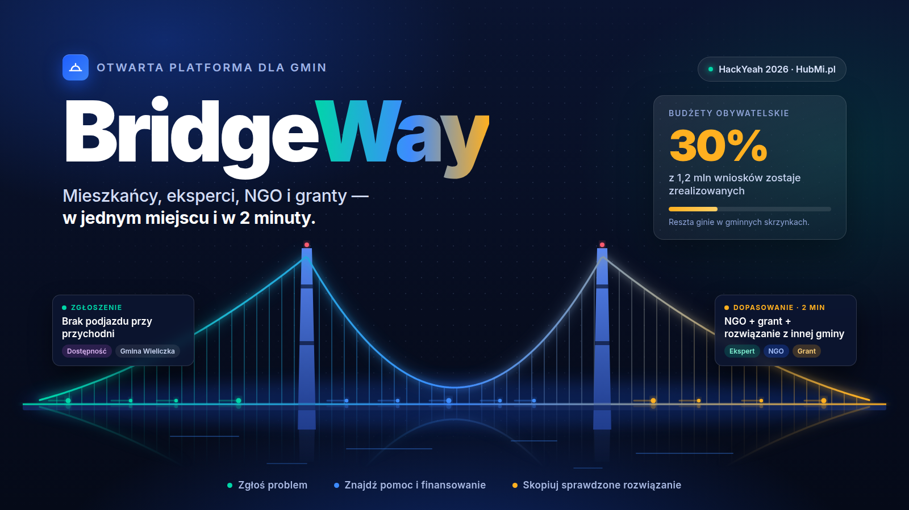

# BridgeWay — HackYeah 2026 project submission

Snapshot of the "Your Project" form on the HackYeah 2026 portal (Biggest Stationary Hackathon in Europe, 3–4 October 2026, Tauron Arena Kraków). Keep this file in sync with what is entered on the portal.



Cover image: [`cover.png`](./cover.png) (1600×900, generated from [`cover.html`](./cover.html) — edit the HTML and re-render, see bottom of this file).

## Basics

| Field | Value |
|---|---|
| Project Name | BridgeWay |
| Published | Yes (visible in the project list) |
| Team lead | Dominik Liahovich |
| Challenge | PARTNER TASK [UMWM]: HubMi.pl |
| Idea stage | New Idea |
| Team status | Full team |
| Current team size | 1 |
| Cover image | `cover.png` (this folder) — to upload |

## Problem

> Lokalne problemy w Polsce giną w gminnych skrzynkach e-mail. Z 1,2 mln wniosków do budżetów obywatelskich i funduszy sołeckich realizowanych jest tylko 30%. Mieszkańcy nie wiedzą, gdzie zgłosić problem, a gminy nie wiedzą, co naprawdę boli ich mieszkańców.

*EN:* Local problems in Poland get lost in municipal e-mail inboxes. Of 1.2 million applications to civic budgets and village funds, only 30% get implemented. Residents don't know where to report a problem, and municipalities don't know what really hurts their residents.

## Solution

> BridgeWay to otwarta platforma, która łączy mieszkańców zgłaszających problemy z ekspertami, NGO i grantami — w jednym miejscu i w 2 minuty. Algorytm dopasowania od razu podpowiada, kto może pomóc i skąd wziąć finansowanie. Sprawdzone rozwiązania można skopiować do kolejnej gminy jednym kliknięciem.

*EN:* BridgeWay is an open platform connecting residents who report problems with experts, NGOs and grants — in one place, in 2 minutes. A matching algorithm immediately suggests who can help and where to get funding. Proven solutions can be copied to another municipality with one click.

## Needed skills

Checked on the form:

- Frontend Developer
- Presentations & Speaking
- Web & Mobile

Not checked: AI & Data Science, Backend Developer, Business & Marketing, Cybersecurity, Databases, Data Engineering, Design & UX, DevOps & Cloud, Embedded & IoT, Expert in specific Task, Other Tech, Pitching & Storytelling, Project/Product Management, QA & Testing, Software Architecture, Software Development.

## Fields still empty (to fill before judging)

| Field | Portal hint | Suggested source |
|---|---|---|
| What's done so far and goal of your project | What was done before the event and what you plan during it | [`roadmap.md`](../roadmap.md) step statuses |
| Skills comment | Detail on skills expected from teammates | — (team is full) |
| Video presentation | Public or Listed YouTube link | demo per [`pitch.md`](../pitch.md) |
| Website | `https://…` | deployed Cloudflare Pages URL |
| Code Repository | — | GitHub repo URL |
| Instructions on how to open project | Boot/open instructions | `npm install && npm run dev`; see [`../../README.md`](../../README.md) |
| Team name | — | — |
| Presentation | PDF/PPTX, max 10 MB | pitch deck |
| Table number | — | assigned on site |
| Additional field for presentation / files | — | — |

## Re-rendering the cover

```bash
google-chrome --headless=new --disable-gpu --hide-scrollbars \
  --window-size=1600,900 --screenshot=spec/project/cover.png \
  file://$PWD/spec/project/cover.html
```
